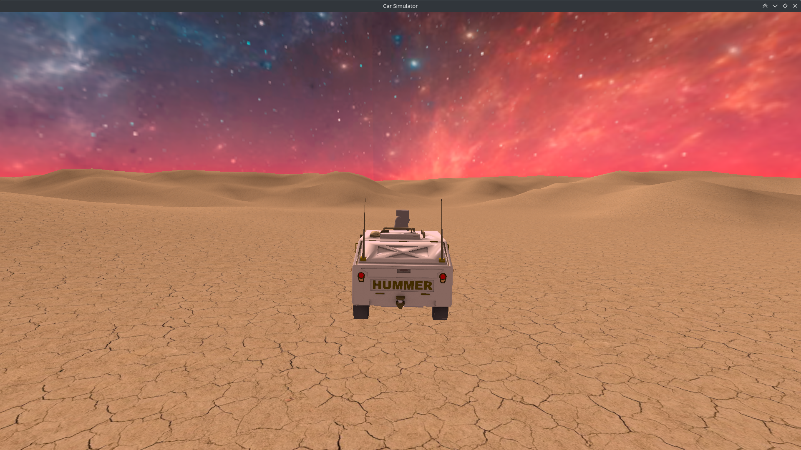
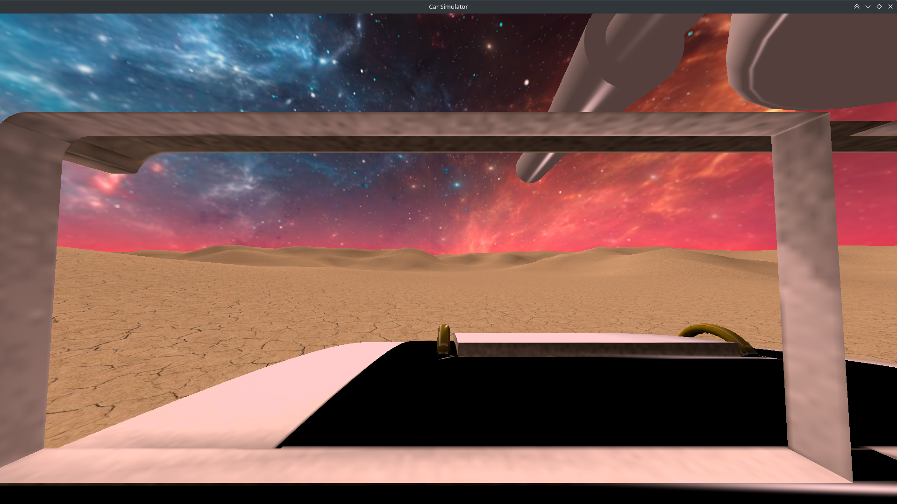
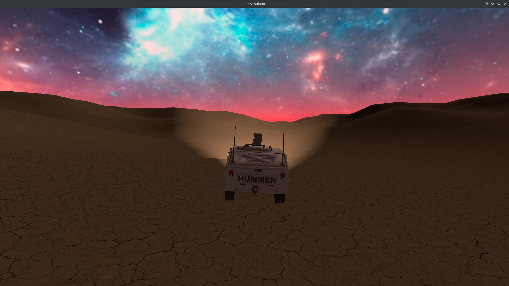
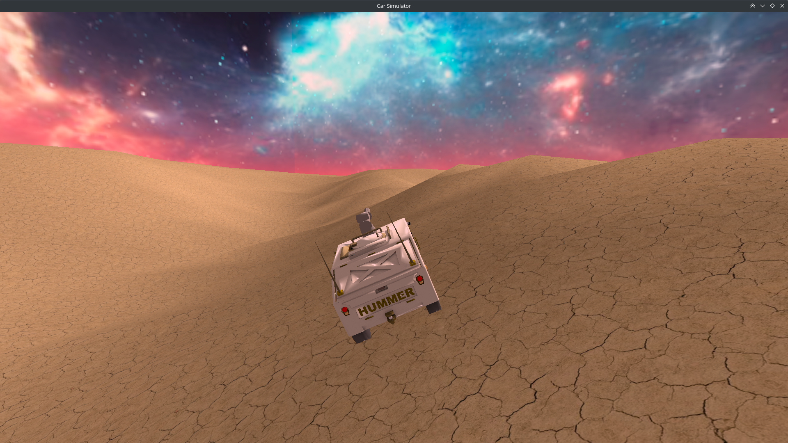
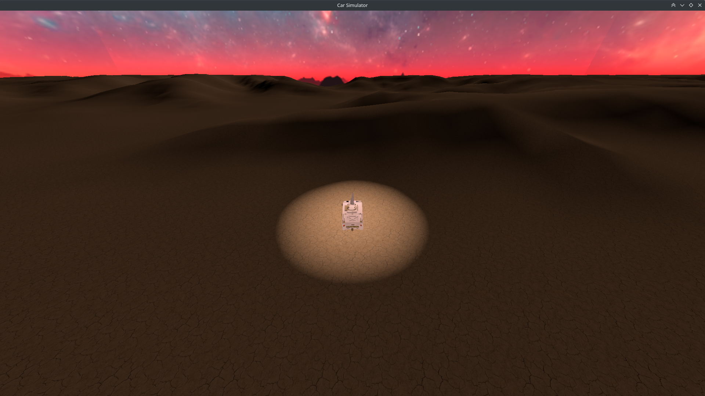

# Vulkan - Car Simulator

Project for the Computer Graphics course at Politecnico di Milano, A.Y. 2021/2022.

## Goal

The goal of the project is stated as follows:
> Design a simulator of a car that navigates in a non-flat environment.
> 
> The point of view has to be in third person and the 3D model of the car has to be aligned with the terrain.

## Run instruction

In order to run the application, use the following instructions:
1. compile the shaders with `./compile_shaders.sh`;
2. compile the application with `make`;
3. execute the application with `make test`.

You can delete the compiled shaders and the executable with `make clean`.

## Vulkan implementation details

The project has been written in C++ and [Vulkan](https://www.vulkan.org), with the help of the following libraries:
- [GLFW](https://www.glfw.org), a library to create windows;
- [GLM](https://github.com/g-truc/glm), a header-only library for linear algebra operations;
- [stb](https://github.com/nothings/stb), a library for loading texture images;
- [tinyobjloader](https://github.com/tinyobjloader/tinyobjloader), a library for loading .obj 3D models.

### Models & Textures

Each object that needs to be rendered has an *.obj* model and one or more textures:
- Car -> `Hummer.obj` and `Hummer.png`;
- Terrain -> `Terrain.obj` and `Terrain.png`;
- SkyBox -> `SkyBox.obj` and `sky/SkyBox_*.png`.

### Shaders

For each one of the three models we have a fragment and a vertex shader:
- Car -> `carShader.frag` and `carShader.vert`;
- Terrain -> `terrainShader.frag` and `terrainShader.vert`;
- SkyBox -> `skyBoxShader.frag` and `skyBoxShader.vert`.

Once compiled, the shaders will generate *.spv* files.

### Uniform Buffers

In total there are four types of UniformBuffers:
- `globalUniformBufferObject`, storing the View Matrix and the Projection matrix;
- `skyboxUniformBufferObject`, storing the Model Matrix for the SkyBox;
- `carUniformBufferObject`, storing the Model Matrix for the Car and and other useful information for the illumination.
- `terrainUniformBufferObject`, storing the Model Matrix for the Terrain and other useful information for the illumination.

### Descriptor Sets & Descriptor Set Layouts

Three types of Descriptor Set Layouts have been created, having the following relationship with Descriptor Sets:
- `DSLglobal`, specifying a template for the `DS_global` Descriptor Set;
- `DSLobj`, specifying a template for the `DS_SlCar` and `DS_SlTerrain` Descriptor Sets;
- `DSLSkyBox`, specifying a template for the `DS_SlSkyBox` Descriptor Set.

### Pipelines

For each one of the objects to be rendered, a pipeline is used:
- Car -> `P_Car`;
- Terrain -> `P_Terrain`;
- SkyBox -> `P_SkyBox`.

All of them are bound to the same Command Buffer.

## Implemented features

Here is a list with all the features that have been implemented in this application:
- multiple cameras
  - third person camera, close to the car (CAM_1)
  - third person camera, far from the car (CAM_2)
  - first person camera (CAM_3)
  - top view from above the car (CAM_4)
- lateral delay of third person cameras when the car is steering
- custom texture for the terrain rendered in "high-res" by the shader
- advance velocity profile of the car
  - acceleration and deceleration
  - maximum velocity that depends on terrain inclination
- car cannot escape from terrain borders
- possibility to reset the car in the initial position
- car height computed by interpolation (with barycentric coordinates)
- precise inclination of the car (yaw, pitch, roll) with interpolation
- resizable window
- multiple illumination modes
  - day-time scenario
    - headlights that can be switched on/off
  - night-time scenario
    - headlights that can be switched on/off
    - spotlight above the centre of the map
- logging of useful information in the cli

## Key bindings

Key bindings for the car movement:
- <kbd>W</kbd> to move forward;
- <kbd>A</kbd> to steer left;
- <kbd>S</kbd> to move backward;
- <kbd>D</kbd> to steer right.

Key bindings for the cameras:
- <kbd>V</kbd> for CAM_1;
- <kbd>B</kbd> for CAM_2;
- <kbd>N</kbd> for CAM_3;
- <kbd>M</kbd> for CAM_4.

Key bindings for other features:
- <kbd>1</kbd> to switch to the day-time scenario;
- <kbd>2</kbd> to switch to the night-time scenario;
- <kbd>space</kbd> to switch on/off the headlights;
- <kbd>R</kbd> to reset to the initial position.

## Screenshots

Here are some screenshots of the application:

## Authors

- Giuseppe Chiari
- Leonardo Gargani
